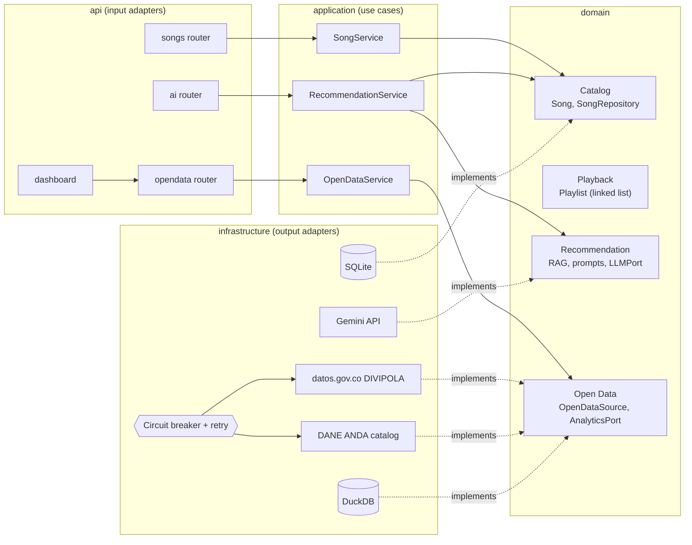

# Bounded contexts and layers

```mermaid
flowchart LR
    subgraph API["api (input adapters)"]
        R1[songs router]
        R2[ai router]
        R3[opendata router]
        R4[dashboard]
    end

    subgraph APP["application (use cases)"]
        S1[SongService]
        S2[RecommendationService]
        S3[OpenDataService]
    end

    subgraph DOM["domain"]
        C1["Catalog<br/>Song, SongRepository"]
        C2["Playback<br/>Playlist (linked list)"]
        C3["Recommendation<br/>RAG, prompts, LLMPort"]
        C4["Open Data<br/>OpenDataSource, AnalyticsPort"]
    end

    subgraph INF["infrastructure (output adapters)"]
        I1[(SQLite)]
        I2[Gemini API]
        I3[datos.gov.co DIVIPOLA]
        I4[DANE ANDA catalog]
        I5[(DuckDB)]
        CB{{Circuit breaker + retry}}
    end

    R1 --> S1 --> C1
    R2 --> S2 --> C3
    S2 --> C1
    R3 --> S3 --> C4
    R4 --> R3
    I1 -. implements .-> C1
    I2 -. implements .-> C3
    CB --> I3
    CB --> I4
    I3 -. implements .-> C4
    I4 -. implements .-> C4
    I5 -. implements .-> C4
```
